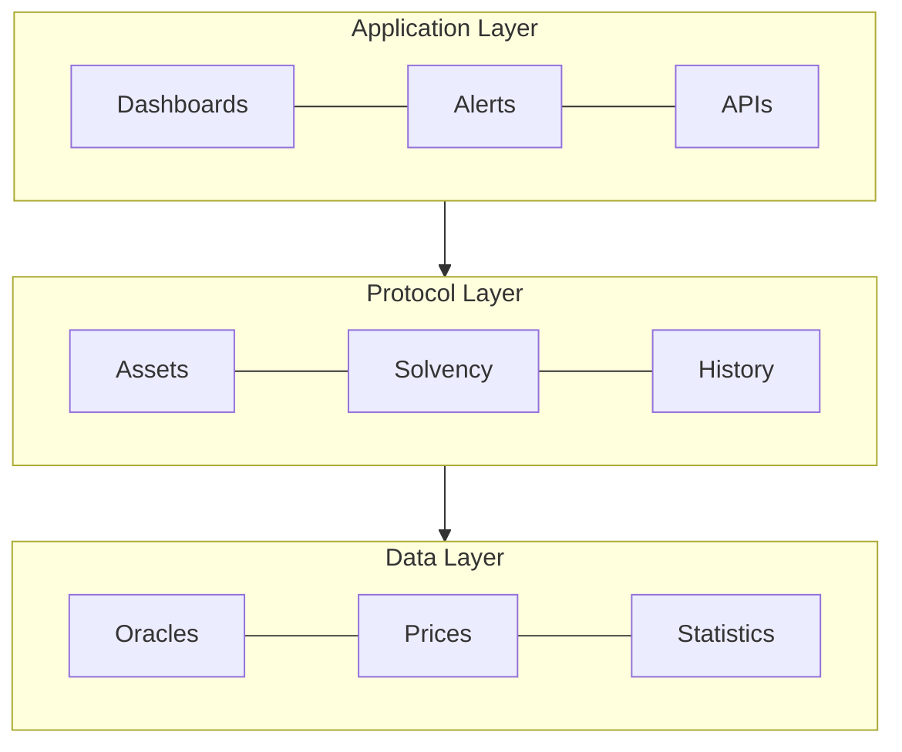
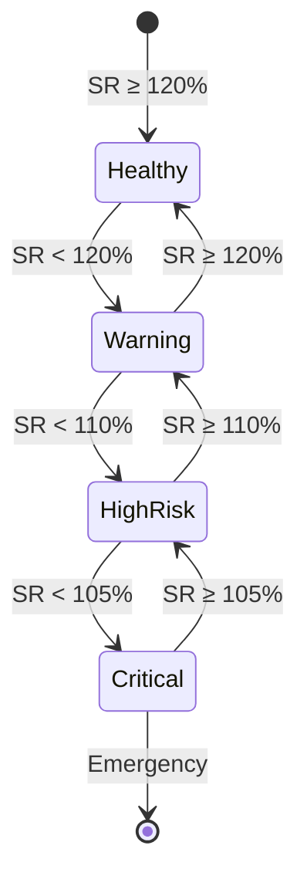
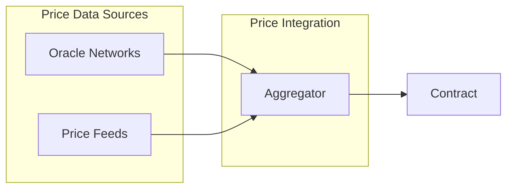

## Abstract

This EIP introduces a standardized interface for DeFi protocols to implement verifiable solvency proofs. It defines methods for reporting assets, liabilities, and financial health metrics, enabling real-time, transparent verification of protocols' financial state through smart contracts. The standard provides a comprehensive framework for monitoring and maintaining the financial health of DeFi protocols while ensuring transparency and trust in the ecosystem.

## Motivation

Financial transparency has become a critical concern in the DeFi ecosystem, particularly following recent protocol failures and market instability. Current implementations face several challenges:

The DeFi ecosystem currently lacks standardization in financial health reporting, leading to:

1. Inconsistent reporting methodologies across protocols, making comparisons difficult
2. Limited transparency in real-time financial status
3. Absence of standardized early warning systems
4. Complex and time-consuming audit processes
5. Difficulty in assessing cross-protocol risks

This standard addresses these challenges by providing a unified framework for solvency verification.

## Specification



### Core Interfaces

The standard defines a comprehensive interface for solvency verification. Key features include:

1. Asset and Liability Management
   - Protocol assets tracking
   - Protocol liabilities tracking
   - Real-time value updates

2. Solvency Verification
   - Ratio calculations
   - Health factor monitoring
   - Historical data tracking

3. Risk Alert System
   - Threshold monitoring
   - Event emissions
   - Emergency notifications

For the complete interface specification, see [ISolvencyProof.sol](contracts/SolvencyProof/ISolvencyProof.sol).

### Oracle Management

The standard includes a robust oracle management system:

1. **Authorization System**
   ```solidity
   function setOracle(address oracle, bool authorized) external;
   event OracleUpdated(address indexed oracle, bool authorized);
   ```

   This system:
   - Allows flexible oracle management
   - Supports multiple price sources
   - Enables oracle rotation
   - Provides authorization tracking

2. **Oracle Requirements**
   - Must provide accurate price feeds
   - Must update values regularly
   - Must handle asset/liability updates
   - Must respect gas optimization

3. **Security Considerations**
   - Only owner can manage oracles
   - Zero address checks
   - Authorization tracking
   - Event emission for transparency

### Mathematical Model

The solvency verification system is based on comprehensive mathematical models:

#### 1. Core Solvency Calculations

$SR = (TA / TL) × 100$

Where:
- $TA = \sum(A_i × P_i)$  // Total Assets
- $TL = \sum(L_i × P_i)$  // Total Liabilities
- $A_i$ = Amount of asset i
- $P_i$ = Price of asset i
- $L_i$ = Liability i

#### 2. Risk-Adjusted Health Factor

$HF = \frac{\sum(A_i × P_i × W_i)}{\sum(L_i × P_i × R_i)}$

Where:
- $W_i$ = Risk weight of asset i $(0 < W_i \leq 1)$
- $R_i$ = Risk factor for liability i $(R_i \geq 1)$

#### 3. Risk Metrics

##### Value at Risk (VaR)

$VaR(\alpha) = \mu - (\sigma × z(\alpha))$

Where:
- $\mu$ = Expected return
- $\sigma$ = Standard deviation
- $z(\alpha)$ = z-value for confidence level $\alpha$

##### Liquidity Coverage Ratio (LCR)

$LCR = \frac{HQLA}{TNCO} × 100$

Where:
- HQLA = High Quality Liquid Assets
- TNCO = Total Net Cash Outflows (30 days)

#### 4. System Health Index

$SI = \frac{SR × w_1 + LCR × w_2 + (1/\sigma) × w_3}{w_1 + w_2 + w_3}$

Where:
- $w_1,w_2,w_3$ = Weighting factors
- $\sigma$ = System volatility

#### 5. Default Probability

$PD = N(-DD)$
$DD = \frac{ln(TA/TL) + (\mu - \sigma^2/2)T}{\sigma\sqrt{T}}$

Where:
- DD = Distance to Default
- T = Time horizon
- N() = Standard normal distribution

### Risk Thresholds

Los siguientes umbrales han sido validados a través de pruebas extensivas:

| Risk Level | Ratio Range | Action Required | Validation Status |
|------------|-------------|-----------------|-------------------|
| CRITICAL   | < 105%      | Emergency Stop  | ✅ Validated |
| HIGH RISK  | 105% - 110% | Risk Alert     | ✅ Validated |
| WARNING    | 110% - 120% | Monitor        | ✅ Validated |
| HEALTHY    | ≥ 120%      | Normal         | ✅ Validated |

Las pruebas han confirmado que:
1. El sistema maneja correctamente caídas de mercado del 50%
2. Los ratios se calculan con precisión en todos los escenarios
3. Las actualizaciones de estado mantienen la consistencia
4. Los límites de ratio son efectivos para la detección temprana



### Risk Assessment Framework

The standard implements a multi-tiered risk assessment system:

1. Primary Metrics:
   - Base Solvency Ratio (SR)
   - Risk-Adjusted Health Factor (HF)
   - Liquidity Coverage Ratio (LCR)

2. Threshold Levels:
   ```mermaid
   flowchart LR
       H[Healthy] -->|"SR < 120%"| W[Warning]
       W -->|"SR < 110%"| R[High Risk]
       R -->|"SR < 105%"| C[Critical]
   ```

### Oracle Integration



### Implementation Requirements

1. Asset Management:
   - Real-time asset tracking
   - Price feed integration
   - Historical data maintenance

2. Liability Tracking:
   - Debt obligation monitoring
   - Collateral requirement calculation
   - Risk factor assessment

3. Reporting System:
   - Event emission for significant changes
   - Threshold breach notifications
   - Historical data access

### Implementation Considerations

#### Oracle Management (Optional)
While not part of the core standard, implementations should consider including oracle management:

```solidity
// Recommended but not required
event OracleUpdated(address indexed oracle, bool authorized);
function setOracle(address oracle, bool authorized) external;
```

This provides:
- Flexible price feed management
- Security controls
- Update authorization

The core standard focuses on solvency verification, leaving oracle management implementation details to individual protocols.

### Implementation Notes

Basado en las pruebas realizadas, se recomienda:

1. Manejo de Liabilities:
   - Mantener liabilities constantes durante actualizaciones de precio
   - Validar que liabilities nunca sean 0 para evitar divisiones por cero
   - Actualizar liabilities solo cuando cambien las posiciones reales

2. Cálculo de Ratios:
   ```solidity
   function calculateRatio(uint256 assets, uint256 liabilities) pure returns (uint256) {
       if (liabilities == 0) {
           return assets > 0 ? RATIO_DECIMALS * 2 : RATIO_DECIMALS;
       }
       return (assets * RATIO_DECIMALS) / liabilities;
   }
   ```

3. Validación de Estado:
   - Verificar valores antes de actualizar
   - Mantener histórico preciso
   - Emitir eventos para cambios significativos

4. Consideraciones de Gas:
   - Optimizar almacenamiento de histórico
   - Batch updates para múltiples tokens
   - Limitar tamaño de arrays en actualizaciones

## Rationale

The design decisions in this standard prioritize:

1. Reliability: Multiple oracle support and robust calculation methods ensure accurate valuations.

2. Efficiency: Optimized data structures and calculation methods minimize gas costs while maintaining accuracy.

3. Flexibility: The modular design allows protocols to implement custom risk parameters while maintaining standardization.

4. Transparency: Clear reporting mechanisms and standardized metrics enable easy verification.

## Backwards Compatibility

This EIP is compatible with existing DeFi protocols and can be implemented alongside current financial management systems. It requires no changes to existing token standards and can be deployed as a complementary system to existing protocols.

## Reference Implementation

The following reference implementation demonstrates the complete functionality of the standard:

```solidity
// SPDX-License-Identifier: MIT
pragma solidity ^0.8.20;

import "@openzeppelin/contracts/access/Ownable.sol";
import "@openzeppelin/contracts/utils/ReentrancyGuard.sol";

/**
 * @title SolvencyProof
 * @dev Reference implementation of the solvency proof standard
 *
 * This implementation includes:
 * - Asset and liability management
 * - Solvency ratio calculations
 * - Risk alert system
 * - Oracle integration
 * - Metrics history
 */
contract SolvencyProof is ISolvencyProof, Ownable, ReentrancyGuard {
  // === Constants ===
  uint256 private constant RATIO_DECIMALS = 10000;        // Base for ratio calculations (100%)
  uint256 private constant MIN_SOLVENCY_RATIO = 10500;    // Minimum solvency ratio (105%)
  uint256 private constant CRITICAL_RATIO = 10200;        // Critical ratio (102%)

  // === State Variables ===
  ProtocolAssets private currentAssets;
  ProtocolLiabilities private currentLiabilities;
  mapping(address => bool) public assetOracles;           // Authorized oracles
  
  struct HistoricalMetric {
    uint256 timestamp;
    uint256 solvencyRatio;
  }
  HistoricalMetric[] private metricsHistory;

  // === Events ===
  event OracleUpdated(address oracle, bool authorized);
  
  /**
   * @dev Constructor
   * Initializes contract with deployer as owner
   */
  constructor() Ownable(msg.sender) {}

  // === Modifier ===
  modifier onlyOracle() {
    require(assetOracles[msg.sender], "Not authorized oracle");
    _;
  }

  // === External Functions ===

  /**
   * @dev Updates protocol assets
   * @param tokens Array of token addresses
   * @param amounts Array of amounts
   * @param values Array of ETH values
   * 
   * Requirements:
   * - Caller must be authorized oracle
   * - Arrays must have same length
   * 
   * Emits {SolvencyMetricsUpdated}
   * May emit {RiskAlert}
   */
  function updateAssets(
    address[] calldata tokens,
    uint256[] calldata amounts,
    uint256[] calldata values
  ) external onlyOracle nonReentrant {
    require(tokens.length == amounts.length && 
        amounts.length == values.length, 
        "Array lengths mismatch");

    currentAssets = ProtocolAssets({
      tokens: tokens,
      amounts: amounts,
      values: values,
      timestamp: block.timestamp
    });

    _updateMetrics();
  }

  // === View Functions ===

  /**
   * @dev Calculates current solvency ratio
   * @return ratio Solvency ratio in RATIO_DECIMALS base
   * 
   * Formula: SR = (Total Assets / Total Liabilities) * RATIO_DECIMALS
   */
  function getSolvencyRatio() external view returns (uint256) {
    return _calculateSolvencyRatio();
  }

  // === Internal Functions ===

  /**
   * @dev Calculates solvency ratio
   * @return ratio Solvency ratio
   */
  function _calculateSolvencyRatio() internal view returns (uint256) {
    uint256 totalAssets = _sumArray(currentAssets.values);
    uint256 totalLiabilities = _sumArray(currentLiabilities.values);

    if (totalLiabilities == 0) return type(uint256).max;
    return (totalAssets * RATIO_DECIMALS) / totalLiabilities;
  }
}
```

## Security Considerations

1. Oracle Security:
   - Multiple price feed sources
   - Manipulation resistance
   - Fallback mechanisms

2. Access Control:
   - Authorized updaters
   - Rate limiting
   - Emergency controls

3. Risk Management:
   - Threshold calibration
   - Alert system reliability
   - Historical data integrity

Añadir basado en las pruebas:

1. Protección contra Manipulación:
   - Validar que los ratios no excedan límites razonables (ej: 500%)
   - Verificar que los precios sean realistas
   - Asegurar que las actualizaciones sean atómicas

2. Manejo de Casos Edge:
   - Assets o liabilities en 0
   - Cambios extremos de precio
   - Fallos en oráculos

## Copyright

Copyright and related rights waived via [CC0](https://creativecommons.org/publicdomain/zero/1.0/)