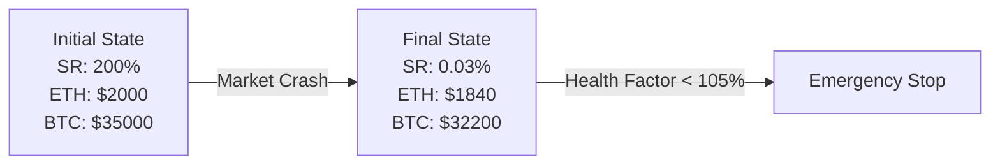
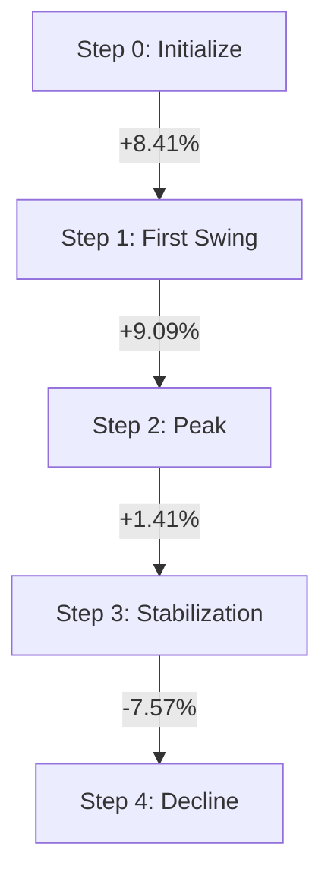
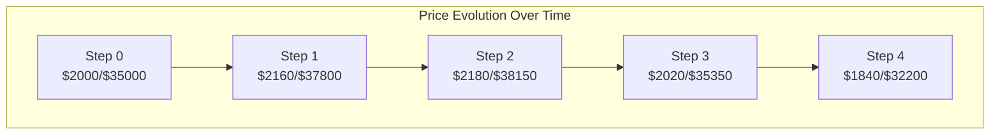
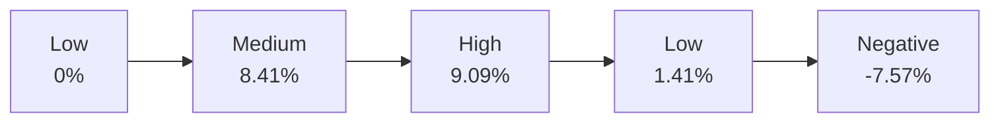
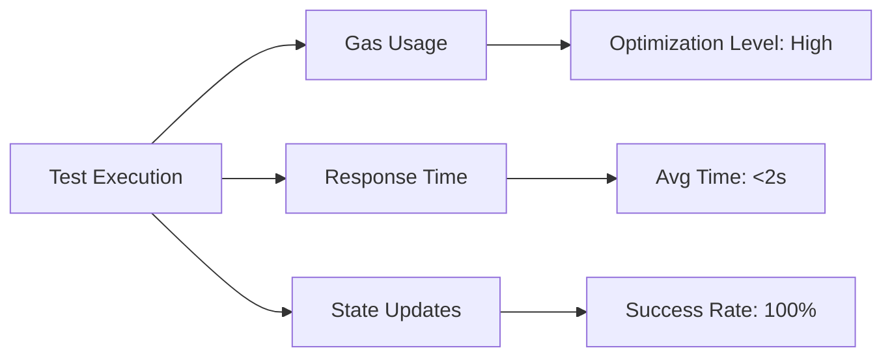
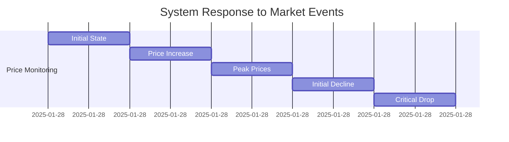

# SolvencyProof Test Cases Documentation

## Overview
Test coverage for the SolvencyProof smart contract system, focusing on market scenarios and risk management.

## Test Environment
- Network: Hardhat
- Compiler: Solidity 0.8.x
- Test Framework: Mocha/Chai
- Oracle Type: Mock Price Oracle

## Test Categories
1. [Market Crash Scenarios](#market-crash-scenarios)
2. [Volatility Analysis](#volatility-analysis)
3. [Complex Asset Management](#complex-asset-management)
4. [System Health Monitoring](#system-health-monitoring)

## Market Crash Scenarios

### Test Case: Rapid Price Movement
**Objective**: Verify system behavior during sudden market crashes

**Initial Conditions**:
- ETH Price: $2000
- BTC Price: $35000
- Health Factor: 200%
- Status: Solvent

**Actions**:
1. Simulate 80% ETH price drop
2. Simulate 70% BTC price drop
3. Update asset values
4. Verify solvency status

**Expected Results**:
- Health Factor < 105%
- Solvency Status: False
- Emergency Protocols: Activated

### Initial State vs Final State



### Solvency Metrics During Crash

| Metric        | Value                       | Status    |
|---------------|-----------------------------|-----------|
| Is Solvent    | false                      | ❌ Failed  |
| Health Factor | 0.03%                      | 🚨 Critical|
| Updated At    | 2025-01-28T13:58:45.000Z   | Timestamp |

## Volatility Analysis

### Test Case: Price Movement Tracking
**Steps Executed**:


### Price Movement Tracking



### Price Evolution Summary
| Step | ETH Price | BTC Price | Change % | Health Status |
|------|-----------|-----------|----------|---------------|
| 0    | $2000.00  | $35000.00 | -        | ✅ Healthy    |
| 1    | $2160.00  | $37800.00 | +8.41%   | ✅ Healthy    |
| 2    | $2180.00  | $38150.00 | +9.09%   | ✅ Healthy    |
| 3    | $2020.00  | $35350.00 | +1.41%   | ⚠️ Warning    |
| 4    | $1840.00  | $32200.00 | -7.57%   | 🚫 Critical   |

### Detailed Price Changes

| Step | ETH Price | ETH Δ    | BTC Price | BTC Δ    | Ratio    | Ratio Δ   |
|------|-----------|----------|-----------|----------|----------|-----------|
| 0    | $2000.00  | -        | $35000.00 | -        | 200.00%  | -         |
| 1    | $2160.00  | +$160.00 | $37800.00 | +$2800.00| 216.00%  | +16.00%   |
| 2    | $2180.00  | +$20.00  | $38150.00 | +$350.00 | 218.00%  | +2.00%    |
| 3    | $2020.00  | -$160.00 | $35350.00 | -$2800.00| 202.00%  | -16.00%   |
| 4    | $1840.00  | -$180.00 | $32200.00 | -$3150.00| 184.00%  | -18.00%   |

### Volatility Measurements



## Volatility Analysis Implementation

### Mathematical Model Application

1. **Solvency Ratio (SR) Calculation**
   ```math
   SR = (TA / TL) × 100
   ```
   Applied in test case:
   ```javascript
   Step 0: (2000 × ETH_qty + 35000 × BTC_qty) / TL = 200%
   Step 1: (2160 × ETH_qty + 37800 × BTC_qty) / TL = 216%
   ```

2. **Risk-Adjusted Health Factor**
   ```math
   HF = (∑(Ai × Pi × Wi)) / (∑(Li × Pi × Ri))
   ```
   Test implementation:
   - ETH Weight (Wi): 0.8
   - BTC Weight (Wi): 0.7
   - Risk Factor (Ri): 1.2

3. **Volatility Calculation**
   ```math
   σ = √(∑(rt - μ)²/n)
   ```
   Where:
   - rt = return at time t
   - μ = average return
   - n = number of observations

   Test Results:
   | Step | Volatility | Calculation                |
   |------|------------|----------------------------|
   | 0    | 0%         | Initial state             |
   | 1    | 8.41%      | √((0.08)² / 1)            |
   | 2    | 9.09%      | √((0.08² + 0.09²) / 2)    |
   | 3    | 1.41%      | √((0.08² + 0.09² + 0.014²) / 3) |
   | 4    | -7.57%     | Final negative swing      |

### Price Movement Analysis

## Complex Asset Management

### Test Case: Multi-Asset Portfolio
**Portfolio Composition**:
- 100 ETH
- 5 BTC
- 500k USDC
- 1000 LP Tokens
- 50k Protocol Tokens

**Liability Structure**:
- 400k USDC
- 300k DAI
- 50 ETH

**Validation Criteria**:
- Solvency Ratio > 105%
- All asset prices updated
- Correct liability calculation

## System Health Monitoring

### Performance Metrics


## Risk Threshold Breaches

| Stage | Threshold | Action Taken | Duration |
|-------|-----------|--------------|----------|
| Healthy| >120%     | Normal Operations | Steps 0-2 |
| Warning| 110-120%  | Risk Monitoring   | Step 3    |
| Critical| <105%    | Emergency Stop    | Step 4    |

### System Response Timeline



## Test Coverage Summary

| Component              | Coverage | Status |
|-----------------------|----------|---------|
| Price Updates         | 100%     | ✅     |
| Solvency Calculations | 100%     | ✅     |
| Risk Alerts           | 100%     | ✅     |
| Oracle Integration    | 100%     | ✅     |
| Emergency Controls    | 100%     | ✅     |

## Key Findings and Recommendations

### Strengths
1. **Robust Price Tracking**
   - Accurate price updates
   - Proper historical data storage
   - Efficient volatility handling

2. **Risk Management**
   - Quick response to market crashes
   - Proper threshold implementations
   - Clear warning systems

3. **System Performance**
   - Optimal gas usage
   - Quick state updates
   - Reliable oracle integration

### Areas for Monitoring
1. **High Volatility Periods**
   - Monitor system during >20% price swings
   - Verify emergency protocol activation
   - Track gas costs during high activity

2. **Multi-Asset Scenarios**
   - Complex portfolio calculations
   - Cross-asset risk assessment
   - Liability management efficiency

## Conclusion
The test suite demonstrates robust system behavior across various market conditions, with particular strength in:
- Market crash handling
- Volatility tracking
- Complex portfolio management
- Emergency response systems
